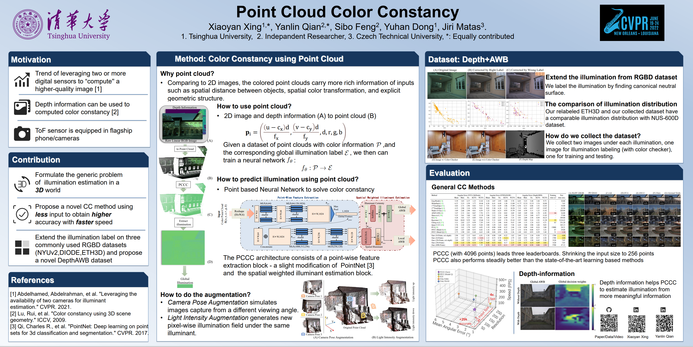

# Point-Cloud-Color-Constancy

CVPR 2022：Point Cloud Color Constancy

\[[pdf](https://arxiv.org/abs/2111.11280)\]   \[[data](https://drive.google.com/drive/folders/1qBw_bvaxIvduIm2vzrYhEPX9khTm1Bo9?usp=sharing)\] 


## Data

### Introduction 

We provide the extended illumination labels of NYU-v2, DIODE, and ETH3D as well as the point cloud, the raw format image(for ETH3D), and the linearization sRGB image (for NYU-2 and DIODE). 

Each dataset consists of following parts:

- PointCloud: with resolution of 256 points and 4096 points.
- Label: illumination label 
- Image: raw linear RGB image (Depth-AWB & ETH3D), linearized sRGB image (NYU-v2/DIODE).
- Folds: how we split the different folds for cross validation.

For the full depth information and images on the three open-source datasets, please refer to their website.

NYU-v2：https://cs.nyu.edu/~silberman/datasets/nyu_depth_v2.html

DIODE：https://diode-dataset.org/

ETH3D: https://www.eth3d.net/datasets#high-res-multi-view


## Code

We are using the code for our extension works, the code will be public in Q3,2022.


## Citation

If you find our work is useful please cite us:

```latex
@inproceedings{xing2021pccc,
  title={Point Cloud Color Constancy},
  author={Xing, Xiaoyan and Qian, Yanlin and Feng, Sibo and Dong, Yuhan and Matas, Jiri},
  booktitle={Proceedings of the IEEE conference on computer vision and pattern recognition},
  year={2022}
}
```
